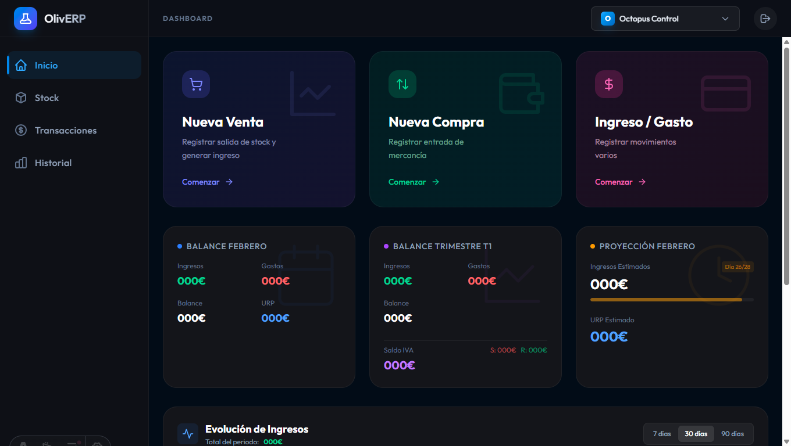

# OlivERP 🚀

**OlivERP** is a modern, lightweight, and high-performance ERP (Enterprise Resource Planning) system designed for personal projects, freelancers, and small businesses. Originally built for personal use by **Oli**, this project is now open-source to help others manage their projects efficiently and to welcome community contributions.



[**🌐 Live Demo**](https://oliverp.pages.dev)


## ✨ Features

- � **Multi-Project Management**: Manage multiple businesses or side-projects from a single dashboard.
- 📦 **Inventory & Stock Tracking**: Real-time stock levels with automatic movement triggers for sales and purchases.
- 💰 **Financial Analytics**: 
  - Track Revenue, Expenses, and Net Profit.
  - Automatic Tax (IVA/VAT) balance calculation.
  - Daily finance visualizations via integrated charts.
- 🛒 **Sales & Purchase Management**: Streamlined workflows for recording transactions and managing product units.
- 📊 **Stock Intelligence**: Predictive alerts for "Days of inventory remaining" and restock valuations.
- ⚡ **Built for Speed**: Powered by Astro for near-instant load times and a sleek developer experience.

## 🛠 Tech Stack

- **Framework**: [Astro 5.x](https://astro.build/) (Static Site Generation & Server-Side Rendering)
- **Styling**: [Tailwind CSS 4.x](https://tailwindcss.com/) (Modern utility-first CSS)
- **Database & Auth**: [Supabase](https://supabase.com/) (PostgreSQL + Realtime + Authentication)
- **Hosting**: [Cloudflare](https://www.cloudflare.com/) (Edge-ready deployment)
- **Visuals**: [Chart.js](https://www.chartjs.org/) for data visualization
- **State Management**: [Nano Stores](https://github.com/nanostores/nanostores)

## 🕹️ Demo Mode

OlivERP features an automatic **Demo Mode**. This allows anyone to explore the full interface and functionality without needing to set up a database or account.

- **How it works**: If the Supabase environment variables are missing or undefined, the application automatically switches to Demo Mode.
- **Mock Data**: The system provides realistic sample data for projects, products, stock levels, and historical financial transactions.
- **Zero Configuration**: Perfect for testing the UI, exploring features, or contributing to the frontend without any backend overhead.


## 🚀 Getting Started

### Prerequisites

- Node.js (Latest LTS recommended)
- [pnpm](https://pnpm.io/) (Preferred) or npm
- A Supabase account

### Installation

1. **Clone the repository**:
   ```bash
   git clone https://github.com/martinezharo/erp.git
   cd erp
   ```

2. **Install dependencies**:
   ```bash
   pnpm install
   ```

3. **Configure Environment Variables**:
   Create a `.env` file in the root directory and add your Supabase credentials:
   ```env
   PUBLIC_SUPABASE_URL=your_supabase_url
   PUBLIC_SUPABASE_ANON_KEY=your_supabase_anon_key
   SUPABASE_SERVICE_ROLE_KEY=your_service_role_key
   ```

4. **Initialize the Database**:
   Run the SQL provided in `structure.sql` in your Supabase SQL Editor to create the necessary tables, views, and triggers.

5. **Start Development Server**:
   ```bash
   pnpm dev
   ```

##  Genie Commands

| Command | Action |
| :--- | :--- |
| `pnpm dev` | Starts local dev server at `localhost:4321` |
| `pnpm build` | Build the production-ready site to `./dist/` |
| `pnpm preview` | Preview your build locally before deploying |
| `pnpm astro ...` | Run Astro CLI commands |

## 🤝 Contributing

Contributions are what make the open-source community such an amazing place to learn, inspire, and create. Any contributions you make are **greatly appreciated**.

Please see [CONTRIBUTING.md](./CONTRIBUTING.md) for details on our code of conduct and the process for submitting pull requests.

## � License

Distributed under the MIT License. See `LICENSE` for more information.

---

Built with ❤️ by [Oli](https://github.com/martinezharo)
